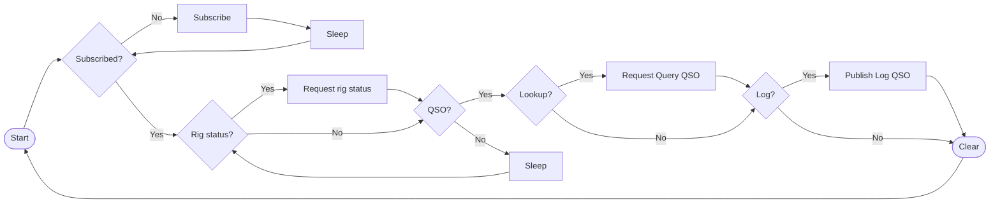
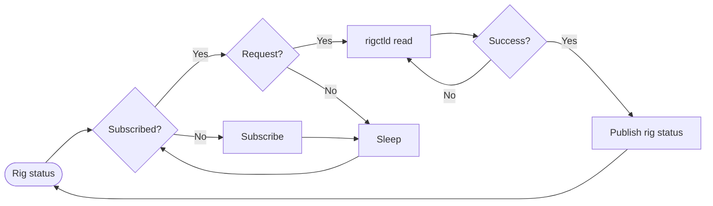
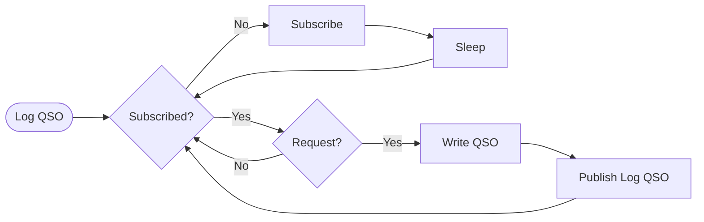
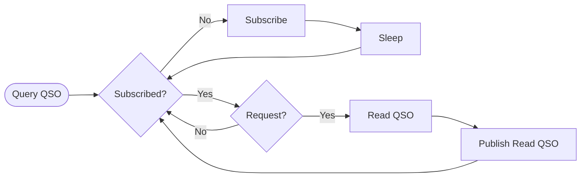

# Ham workflows

## Fox or Hound

```mermaid
flowchart LR;
    Start([Start]);
    Clear([Clear]);
    Start --> Subscribed0{Subscribed?};
    Subscribed0 -->|Yes| Rig0;
    Subscribed0 -->|No| Subscribed1[Subscribe];
    Subscribed1 --> Sleep0[Sleep];
    Sleep0 --> Subscribed0;
    Rig0{Rig status?};
    Rig0 -->|Yes| Rig1[Request rig status];
    Rig1 --> QSO0{QSO?};
    Rig0 -->|No| QSO0; 
QSO0 -->|Yes| Lookup0{Lookup?};
    QSO0 -->|No| QSO1[Sleep];
    QSO1 --> Rig0;
    Lookup0 -->|Yes| Lookup1[Request Query QSO];
    Lookup1 --> LogQSO0;
    Lookup0 -->|No| LogQSO0{Log?};
    LogQSO0 -->|Yes| LogQSO1[Publish Log QSO];
    LogQSO1 --> Clear;
    LogQSO0 -->|No| Clear;
    Clear --> Start;
```

## Rig status

```mermaid
flowchart LR;
    Start([Rig status]);
    Start --> Subscribed0{Subscribed?};
    Subscribed0 -->|Yes| Request0{Request?};
    Subscribed0 -->|No| Subscribed1[Subscribe];
    Subscribed1 --> Sleep0[Sleep];
    Request0 -->|Yes| Read0[rigctld read];
    Sleep0 --> Subscribed0;
    Request0 -->|No| Sleep0;
    Read0 --> Read1{Success?};
    Read1 -->|Yes| Publish0[Publish rig status];
    Read1 -->|No| Read0;
    Publish0 --> Start;    
```

## Log QSO

```mermaid
flowchart LR;
    LogQSO([Log QSO]);
    LogQSO --> Subscribed0{Subscribed?};
    Subscribed0 -->|Yes| Request0{Request?};
    Subscribed0 -->|No| Subscribed1[Subscribe];
    Subscribed1 --> Sleep0[Sleep];
    Sleep0 --> Subscribed0;
    Request0 -->|Yes| WriteQSO0[Write QSO];
    Request0 -->|No| Subscribed0;
    WriteQSO0 --> Publish0[Publish Log QSO];
    Publish0 --> Subscribed0;
```

## Query QSO

```mermaid
flowchart LR;
    QueryQSO([Query QSO]);
    QueryQSO --> Subscribed0{Subscribed?};
    Subscribed0 -->|Yes| Request0{Request?};
    Subscribed0 -->|No| Subscribed1[Subscribe];
    Subscribed1 --> Sleep0[Sleep];
    Sleep0 --> Subscribed0;
    Request0 -->|Yes| ReadQSO0[Read QSO];
    Request0 -->|No| Subscribed0;
    ReadQSO0 --> Publish0[Publish Read QSO];
    Publish0 --> Subscribed0;    

```

