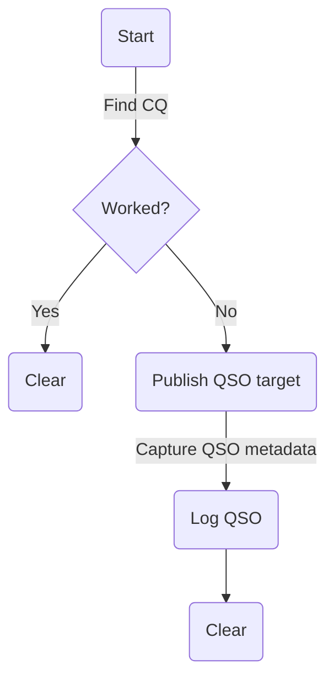

# Musings about modern ham workflows

## Hunt

```mermaid
flowchart TD;
    A(Start) -->|Find CQ| B{Worked?};
    B -->|Yes| C(Clear);
    B -->|No| D(Publish QSO target);
    D -->|Capture QSO metadata| E(Log QSO);
    E -->F(Clear)
```
