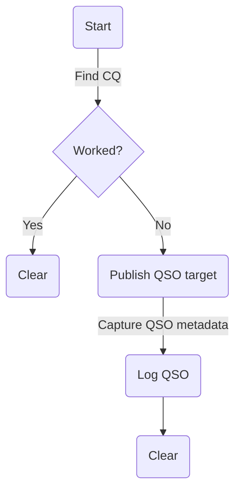
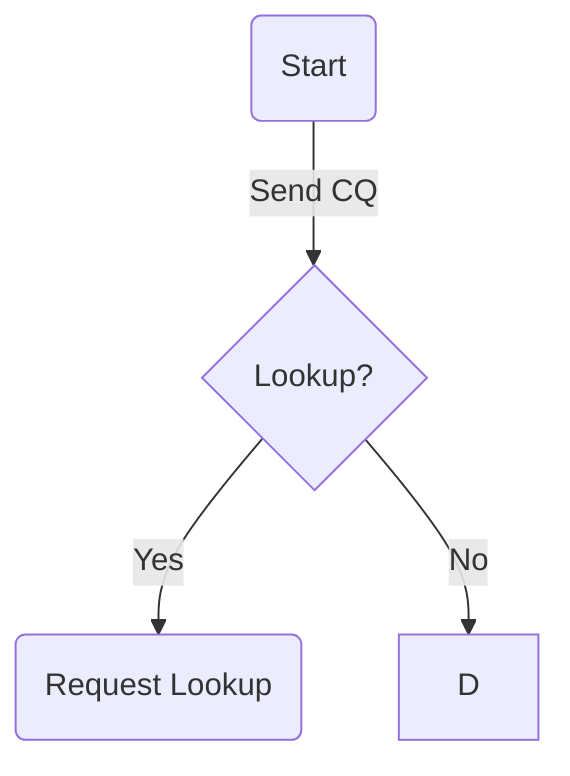

# Ham workflows

## Hound

```mermaid
flowchart TD;
    A(Start) -->|Find CQ| B{Worked?};
    B -->|Yes| C(Clear);
    B -->|No| D(Publish QSO target);
    D -->|Capture QSO metadata| E(Log QSO);
    E -->F(Clear)
```

## Fox

```mermaid
flowchart TD;
    A(Start) -->|Send CQ| B{Lookup?};
    B -->|Yes| C(Request Lookup);
    B -->|No| D;
```
