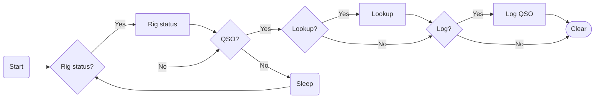
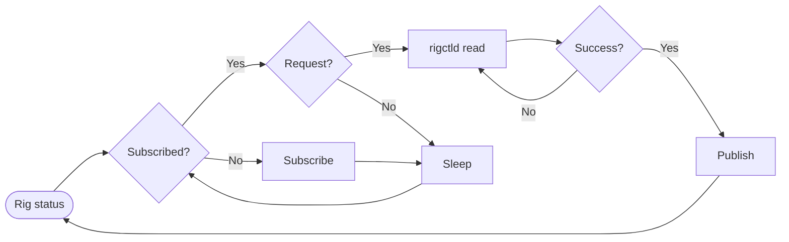

# Ham workflows

## Fox or Hound

```mermaid
flowchart LR;
    Start([Start]);
        Clear([Clear]);
    Start(Start) --> Rig0{Rig status?};
    Rig0 -->|Yes| Rig1[Rig status];
    Rig1 --> QSO0{QSO?};
    Rig0 -->|No| QSO0; 
    QSO0 -->|Yes| Lookup0{Lookup?};
    QSO0 -->|No| QSO1(Sleep);
    QSO1 --> Rig0;
    Lookup0 -->|Yes| Lookup1[Lookup];
    Lookup1 --> Log0;
    Lookup0 -->|No| Log0{Log?};
    Log0 -->|Yes| Log1[Log QSO];
    Log1 --> Clear;
    Log0 -->|No| Clear;
```

## Rig status

```mermaid
flowchart LR;
    Start([Rig status]);
    Start --> Subscribed0{Subscribed?};
    Subscribed0 -->|Yes| Request0{Request?};
    Subscribed0 -->|No| Subscribed1[Subscribe];
    Subscribed1 --> Sleep0[Sleep];
    Request0 -->|Yes| Read0[rigctld read];
    Sleep0 --> Subscribed0;
    Request0 -->|No| Sleep0;
    Read0 --> Read1{Success?};
    Read1 -->|Yes| Publish0[Publish];
    Read1 -->|No| Read0;
    Publish0 --> Start;    
```

