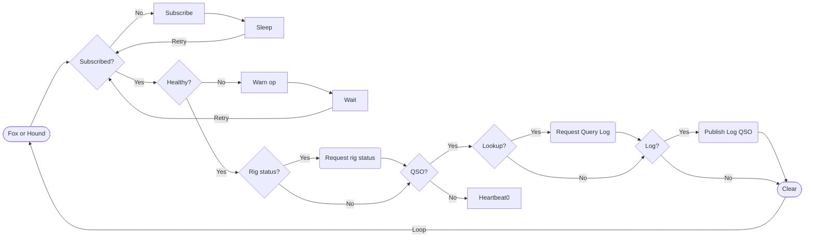
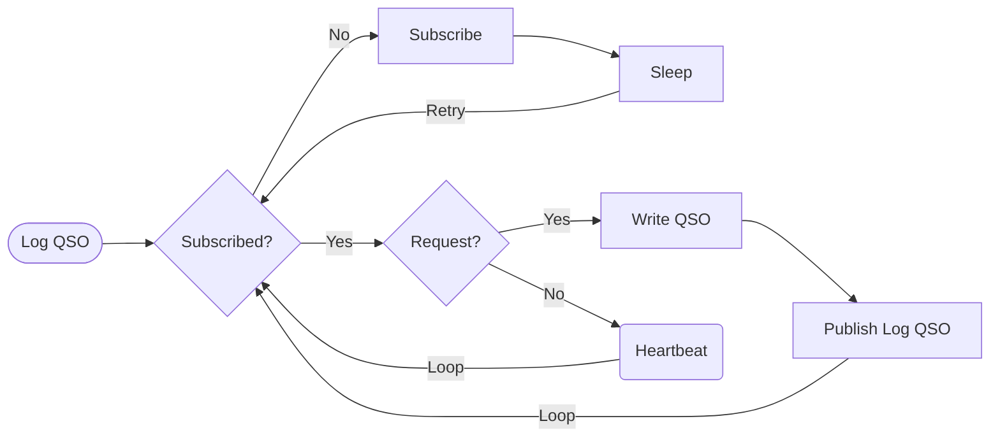
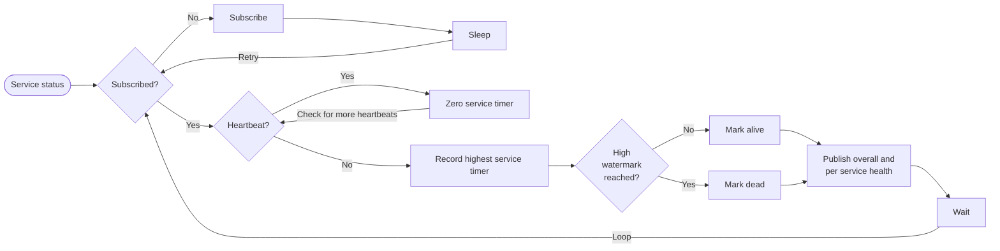

# Ham workflows

Different microservice flows broken down with interactions.  Each workflow publishes a heartbeat when not performing work and after work is successfully completed.  The heartbeat wait interval must be _greater_ than the slowest operation to prevent the heartbeat from going stale.

1. [Fox or Hound](#fox-or-hound)  
    Calls _Rig status request_, _Query Log reqeust_, _Log QSO request_, and _Publish Heartbeat_

2. [Rig status request](#rig-status-request)  
    Calls _Publish Heartbeat_

3. [Log QSO request](#log-qso-request)  
    Calls _Publish Heartbeat_

4. [Query Log request](#query-log-request)  
    Calls _Publish Heartbeat_

5. [Publish Heartbeat](#publish-heartbeat)

## Workflows

### Fox or Hound

---

### Rig status request

---

### Log QSO request

---

### Query Log request

---

### Publish heartbeat

---

### Service health

