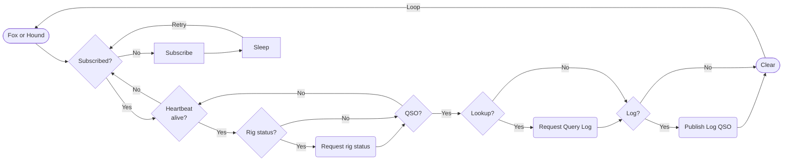
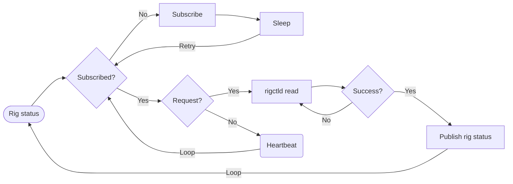
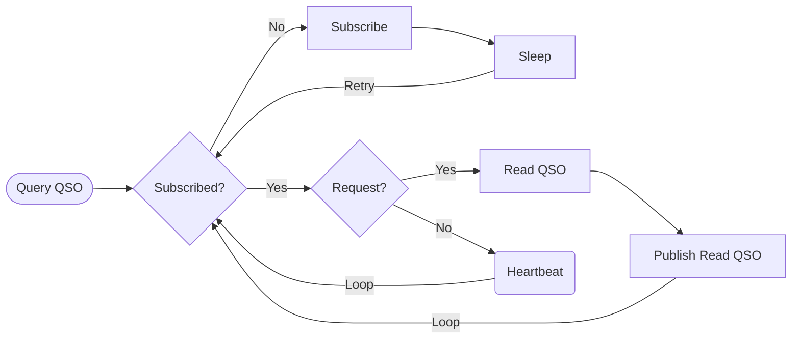
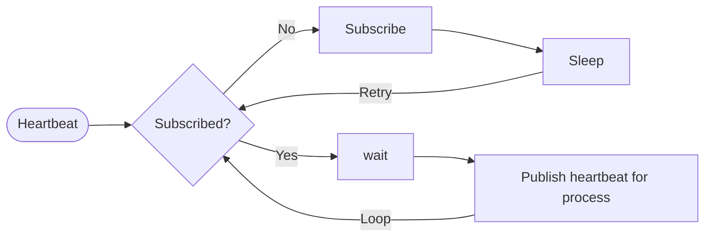

# Ham workflows

Different microservice flows broken down with interactions.

1. [Fox or Hound](#fox-or-hound)
2. [Rig status request](#rig-status-request)
3. [Log QSO request](#log-qso-request)
4. [Query Log request](#query-log-request)
5. [Publish Heartbeat](#publish-heartbeat)

## Workflows

### Fox or Hound

---

### Rig status request

---

### Log QSO request

---

### Query Log request

---

### Publish heartbeat

