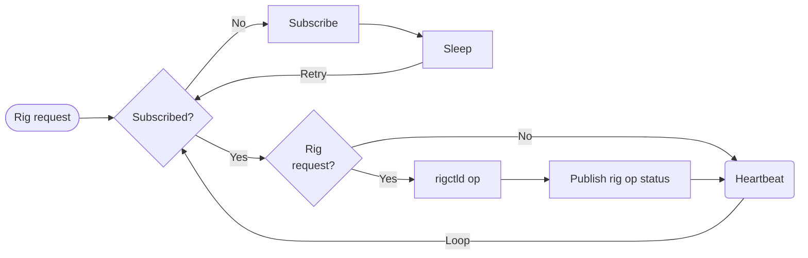
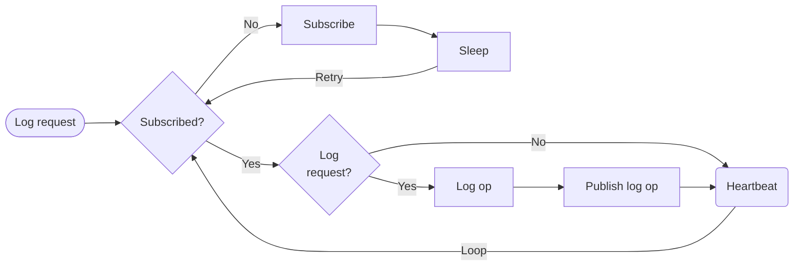
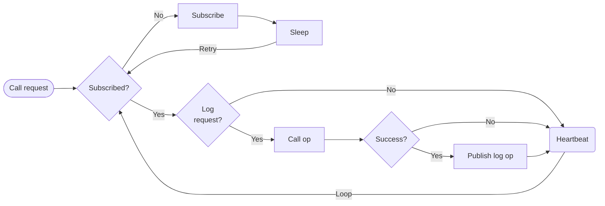
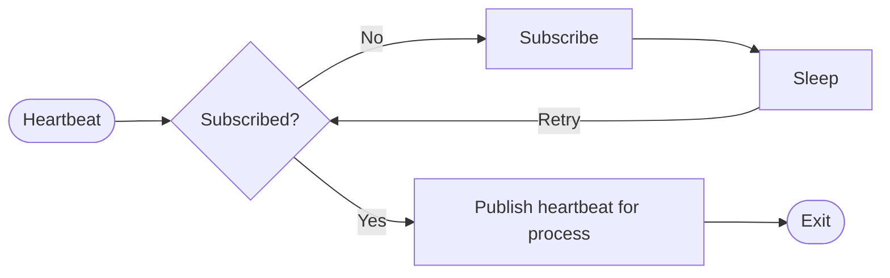
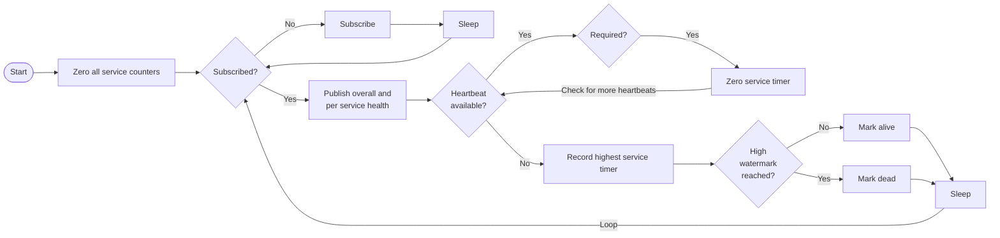
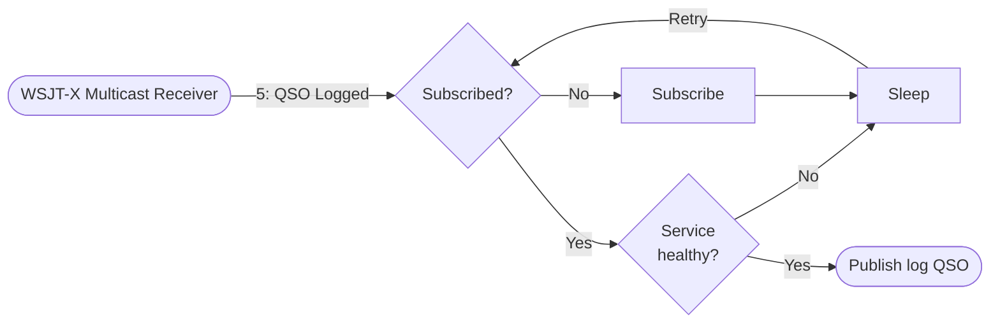
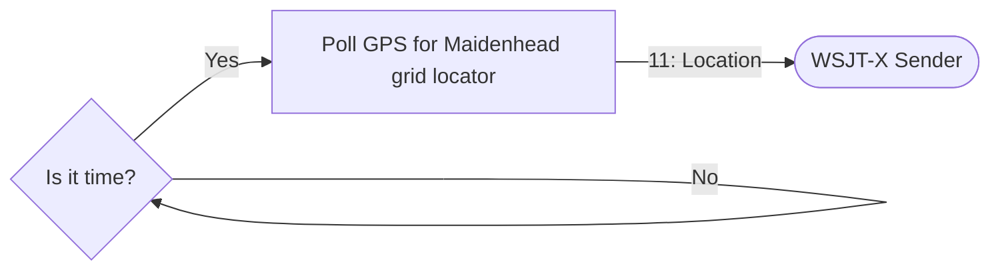

```mermaid
flowchart LR;
    Start([Logging UI Loop]);
    Health0{Service<br>healthy?};
    Rig0{Rig status<br>integration?}
    Keyer0{Keyer<br>requested?};
    QSOUI0{Call<br>available?};
    QSOUI1{exchange?}
    QSOUI2{QSO<br>complete?}
    Lookup0{Call<br>lookup?};
    Lookup2{Log<br>lookup?};
    Clear([Clear]);
    Start --> Subscribed0{Subscribed?};
    Subscribed0 -->|No| Subscribed1[Subscribe];
    Subscribed0 -->|Yes| Health0;
    Subscribed1 --> Health0;
    Health0 -->|No| Sleep0[Sleep];
    Sleep0 -->|Retry| Subscribed0;
    Health0 -->|Yes| Rig0;
    Rig0 -->|Yes| Rig1([Request rig status]);
    Rig0 -->|No| Keyer0;
    Rig0 -->|Abandon| Clear;
    Rig1 --> Keyer0;
    Keyer0 -->|No| QSOUI0;
    Keyer0 -->|Yes| Keyer1([Run memory keyer]);
    Keyer1 --> QSOUI0;
    QSOUI0 -->|UI Loop| Subscribed0;
    QSOUI0 -->|Yes| Lookup0;
    QSOUI0 --> |Abandon| Clear;
    Lookup0 -->|Yes| Lookup1([Call lookup]);
    Lookup0 -->|No| Lookup2;
    Lookup1 --> Lookup2;
    Lookup2 -->|Yes| Lookup3([Log lookup]);
    Lookup2 -->|No| QSOUI1;
    Lookup3 --> QSOUI1;
    QSOUI1 -->|No| QSOUI2;
    QSOUI1 -->|Yes| Exchange0[capture exch];
    Exchange0 --> QSOUI2;
    QSOUI2 -->|UI Loop| QSOUI1;
    QSOUI2 -->|Yes| LogRequest0([Publish log QSO]);
    QSOUI2 -->|Abandon| Clear;
    LogRequest0 -->|Next QSO| Subscribed0;
    Clear --> Exit0{Exit?};
    Exit0 -->|No| Subscribed0;
    Exit0 -->|Yes| Exit1;
    Exit1([Exit]);
```

# Ham workflows

I wrote this document to capture how ham radio operator workflows can be broken down into different microservice flows with interactions.   This also includes the notion of service health being integral to the system to prevent scenarios where something is inop and you don't find out until after the fact that information didn't get captured as you thought it would.  If the service health is bad, _Fox or Hound_ flow is inop.

1. [Logging UI Loop (Fox or Hound)](#logging-ui-loop-fox-or-hound)  
    Calls _[Rig request](#rig-request)_, _[Log request](#log-request)_, _[Call request](#call-request)_, and _[Service Health](#service-health)_

2. [Rig request](#rig-request)  
    Calls _[Publish Heartbeat](#publish-heartbeat)_

3. [Log request](#log-request)  
    Calls _[Publish Heartbeat](#publish-heartbeat)_

4. [Call request](#call-request)  
    Calls _[Publish Heartbeat](#publish-heartbeat)_

5. [Publish Heartbeat](#publish-heartbeat)

6. [Service Health](#service-health)  
    Consumes _[Publish Heartbeat](#publish-heartbeat)_ messages.

7. [WSJT-X integration](#wsjt-x-integration)  
    Consumes _[Publish Heartbeat](#publish-heartbeat)_ messages.

---

## Workflows

### Logging UI Loop (Fox or Hound)

#### Description

Main UI loop for logging QSOs.  If services are healthy, optional rig status, optional call lookups, and eventually QSO lookups are performed.  Rig control is out of scope.

#### Diagram

---

### Rig request

#### Description

Perform a read or write to rigctld to interact with the rig. Publish a heartbeat. If an operation was performed, the heartbeat indicates success or failure.

Read or Write.

#### Diagram

---

### Log request

#### Description

Perform a log read or write against one or more defined databases. Publish a heartbeat. If an operation was performed, the heartbeat indicates success or failure.

Read or Write.

#### Diagram

---

### Call request

#### Description

Perform a call database lookup one or more defined databases. Publish a heartbeat. If an operation was performed, the heartbeat indicates success or failure.

Reads only.

#### Diagram

---

### Publish heartbeat

#### Description

Fragment which defines how services publish their heartbeat. Each heartbeat contains the name of the service reporting and once published the fragment is complete.

Writes only.

#### Diagram

---

### Service health

#### Description

Each workflow publishes a heartbeat when not performing work and after work is successfully completed. The heartbeat wait dead timer must be _greater_ than the slowest operation to prevent the heartbeat from going stale. As long as all services check in at least once within a specified interval, the service health is alive. Otherwise it is dead.

Reads only.

#### Diagram

---

### WSJT-X Integration

#### Description

1. Log QSO.
2. Updated location.

#### Diagrams

**(1)**

**(2)**

---

## Notes:

WSJT-X message format: https://sourceforge.net/p/wsjt/wsjtx/ci/master/tree/Network/NetworkMessage.hpp
